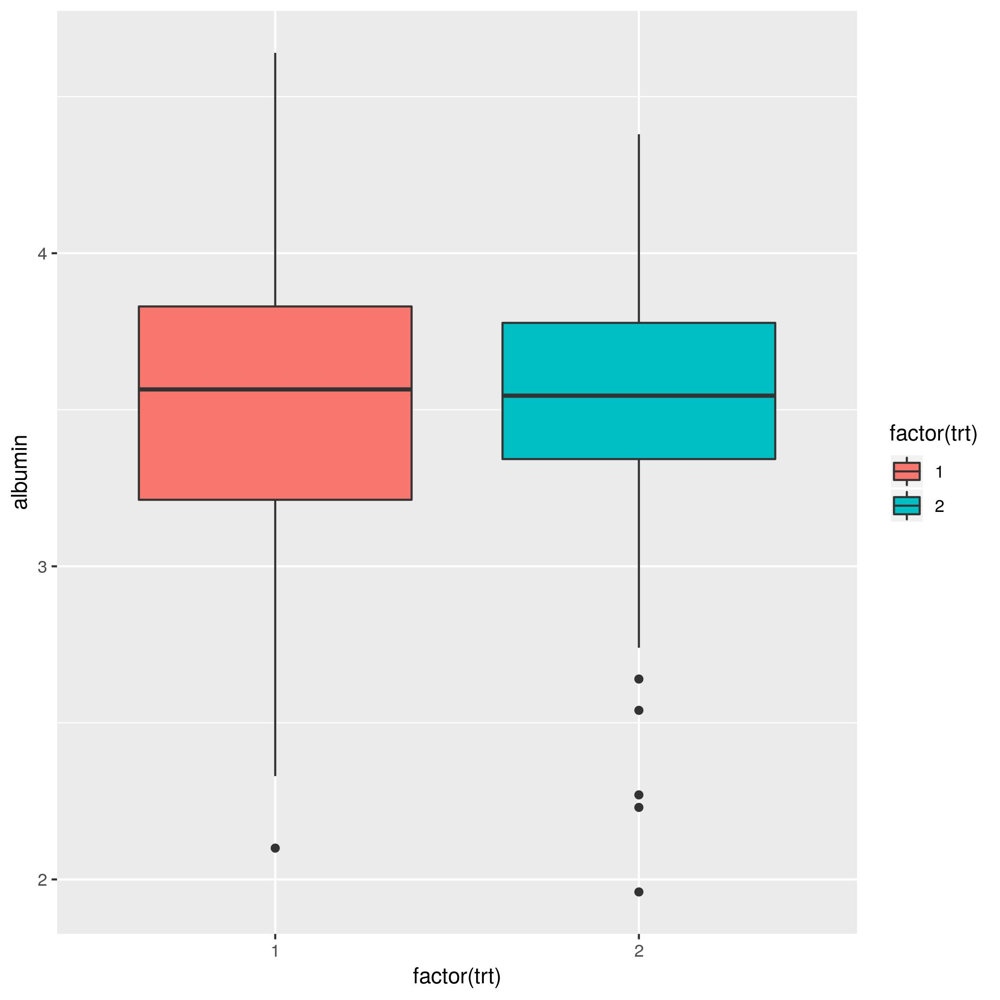
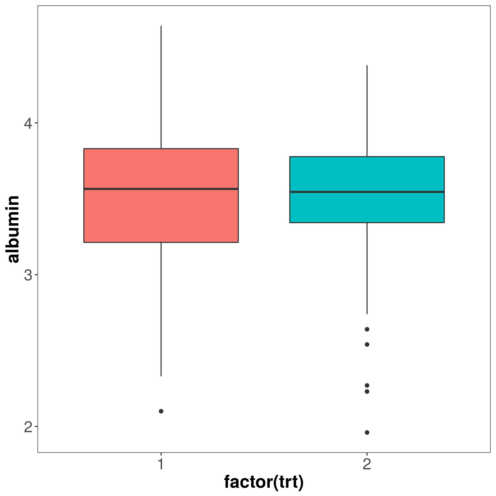
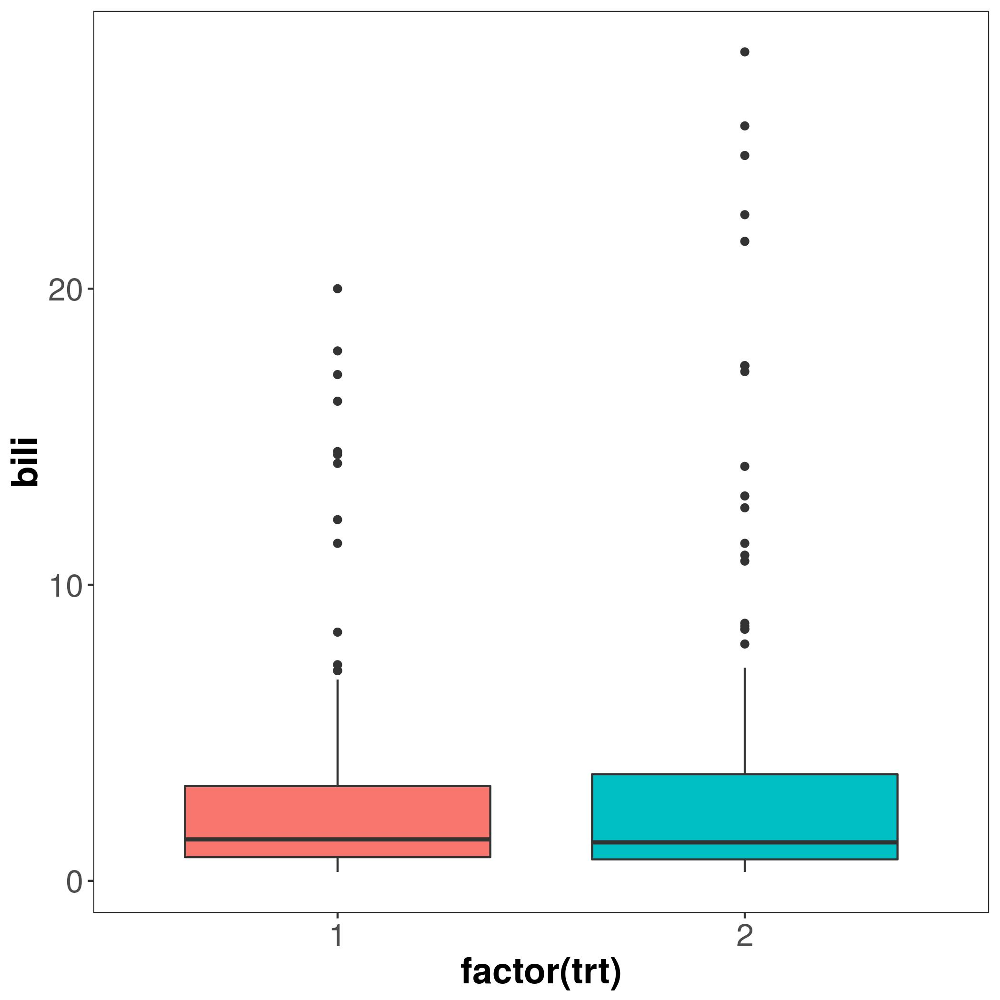
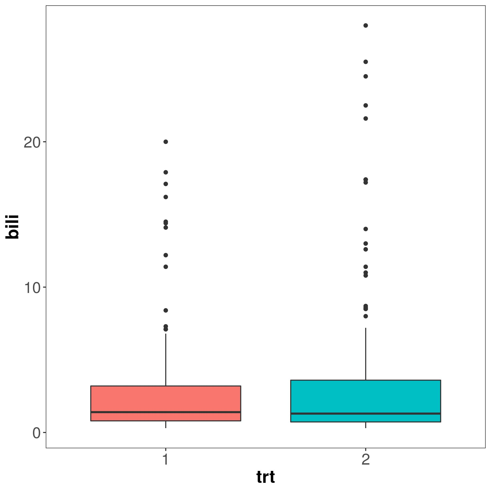

```{r setup, include=FALSE}
knitr::opts_chunk$set(echo=TRUE, eval=TRUE, cache=TRUE)
library(tidyverse)
library(survival)
```
# Introduction

## whoami

<div class="column1">

fuuuumin314

@[twitter](https://twitter.com/fuuuumin314)

研修医

R歴: ５年, 臨床データの解析

</div>

<div class="column2" style="float: right;">


</div>

## DRY: Don't Repeat Yourself

- 同じコードの繰り返しを避ける
- 可読性
- 再利用性

## demo data

- survival::pbc
- 肝臓の病気に対する治療データ

# Setting themes

## 基本的なplot

```{r, eval=FALSE}
pbc %>% 
  dplyr::filter(!is.na(trt)) %>% 
  ggplot(aes(factor(trt), albumin, fill=factor(trt))) + 
    geom_boxplot()
```

```{r, eval=TRUE, echo=FALSE, message=FALSE}
p <- pbc %>% 
  dplyr::filter(!is.na(trt)) %>% 
  ggplot(aes(factor(trt), albumin, fill=factor(trt))) + 
    geom_boxplot()
ggsave(filename="./img/theme1.jpg", plot=p, device="jpg")
```

##

  

## plotできたけど……

- 全体的にフォントが小さい
- 背景のグレーを白地にしたい
- 罫線を消したい
- 判例を消したい

など共通で設定したい事項がある

## 修正してみる

```{r, eval=FALSE}
pbc %>% 
  dplyr::filter(!is.na(trt)) %>% 
  ggplot(aes(factor(trt), albumin, fill=factor(trt))) + 
    geom_boxplot() +
    theme_bw() +
    theme(axis.text=element_text(size=16), 
          axis.title=element_text(size=18, face="bold"), 
          legend.position="none")
```

```{r, eval=TRUE, echo=FALSE, message=FALSE}
p <- pbc %>% 
  dplyr::filter(!is.na(trt)) %>% 
  ggplot(aes(factor(trt), albumin, fill=factor(trt))) + 
    geom_boxplot() +
    theme_bw() +
    theme(axis.text=element_text(size=16), 
          axis.title=element_text(size=18, face="bold"),
          panel.grid.major = element_blank(),
          panel.grid.minor = element_blank(),
          legend.position="none")
ggsave(filename="./img/theme2.jpg", plot=p, device="jpg")
```

## 比較

<div class="column1" style="float: left;">


</div>

<div class="column2" style="float: right;">



</div>

## 共通の設定にするには

`theme_set()`

```{r, eval=FALSE}
my_theme <- theme_bw() + 
  theme(axis.text=element_text(size=16), 
    axis.title=element_text(size=18, face="bold"),
    panel.grid.major = element_blank(),
    panel.grid.minor = element_blank(),
    legend.position="none")
theme_set(my_theme)
pbc %>% 
  dplyr::filter(!is.na(trt)) %>% 
  ggplot(aes(factor(trt), bili, fill=factor(trt))) +
  geom_boxplot()
```

```{r, echo=FALSE, message=FALSE}
my_theme <- theme_bw() + 
  theme(axis.text=element_text(size=16), 
    axis.title=element_text(size=18, face="bold"),
    panel.grid.major = element_blank(),
    panel.grid.minor = element_blank(),
    legend.position="none")
theme_set(my_theme)
p <- pbc %>% 
    dplyr::filter(!is.na(trt)) %>% 
    ggplot(aes(factor(trt), bili, fill=factor(trt))) +
  geom_boxplot()
ggsave("./img/theme3.jpg", p, device="jpg")
```

##



# Writing functions

## ggplotで関数を作る

```{r, eval=FALSE}
pbc$trt <- as.factor(pbc$trt)
pbc_box_func <- function(x, y) {
  theme_set(my_theme)
  pbc %>% 
    filter(!is.na(!!sym(x))) %>% 
    ggplot(aes(x = !!sym(x), y = !!sym(y))) +
    geom_boxplot()
}
pbc_box_func("trt", "bili")
```

```{r, echo=FALSE, message=FALSE}
pbc$trt <- as.factor(pbc$trt)
pbc_box_func <- function(x, y) {
  theme_set(my_theme)
  pbc %>% 
    filter(!is.na(!!sym(x))) %>% 
    ggplot(aes(x=!!sym(x), y=!!sym(y), fill=!!sym(x))) +
    geom_boxplot()
}
p <- pbc_box_func("trt", "bili")
ggsave("./img/functions1.jpg", p, device="jpg")
```

##



# Utilizing purrr

## map で繰り返しを避ける

```{r}
my_vars <- set_names(c("bili", "chol", "albumin", "ast"))
dry_plots <- purrr::map(my_vars, ~pbc_box_func("trt", .x))
```

## 

```{r}
dry_plots[[1]]
# same as dry_plots$bili
```

##

```{r}
dry_plots[[2]]
```

##

```{r}
dry_plots[[3]]
```

##

```{r}
dry_plots[[4]]
```

## まとめ

- 共通の設定を使うときには`set_theme()`
- ggplotで関数を作るときは注意が必要

詳しくはtidy evaluationで検索

- 関数を繰り返すときは`purrr::map()`

# Appendix

## reference
- [automate exploratory plots](https://aosmith.rbind.io/2018/08/20/automating-exploratory-plots/)
- [tidy evaluation](https://tidyeval.tidyverse.org/)
- [スライドループ回避](https://qiita.com/mwmsnn/items/e01f36a6245617354065)

## Environment info

```{r}
devtools::session_info()[[1]]
```

## 

```{r}
devtools::session_info()[[2]]
```
